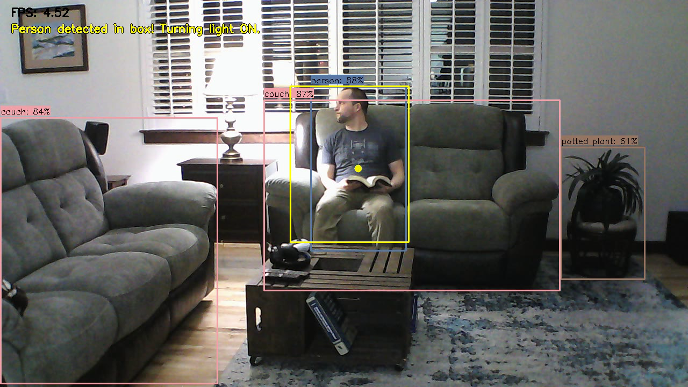
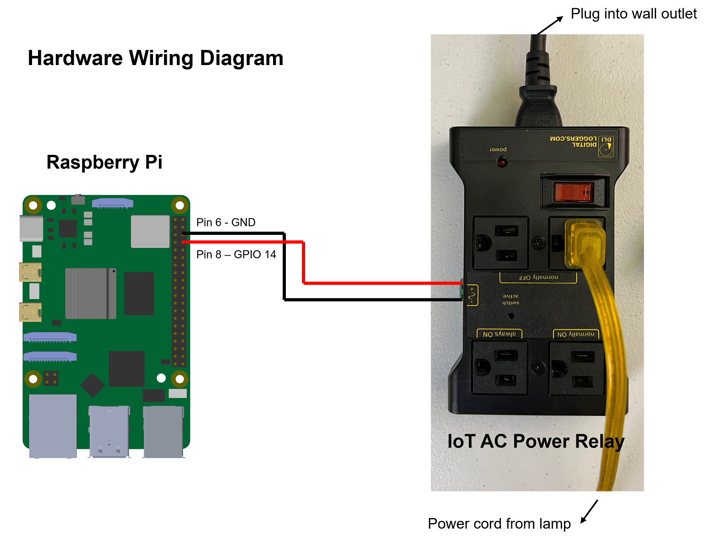

# Toggle Raspberry Pi GPIO - Smart Lamp Example
One cool way to use the Raspberry Pi and YOLO is to control real-world devices when certain events occur. The [toggle_pi_gpio.py](toggle_pi_gpio.py) example shows how to set up a "smart lamp" that turns on when a person is detected within a certain area of the camera's view. This example is a useful starting point to see how to toggle the Raspberry Pi's General-Purpose Input/Output (GPIO) pins using YOLO and Python. You can see the smart lamp in action in my YouTube video for [Running YOLO Models on the Raspberry Pi](google.com).

<p align="center">
  
</p>

This README shows how connect the Raspberry Pi to an [AC Power Relay](https://amzn.to/3WJASk8), which is controlled with the Pi's GPIO to turn devices on and off when certain objects are detected. It also shows how to configure and run the toggle_pi_gpio.py script on the Pi.

## Requirements

Hardware required:
* [Raspberry Pi 5](https://amzn.to/3Qo4wrX) or Raspberry Pi 4
* [DIGITAL LOGGERS IoT AC Power Relay](https://amzn.to/3WJASk8) - this is an easy-to-use and safe device for turning wall-connected devices (such as lights) on and off with the Pi
* [Male-to-female GPIO wires](https://amzn.to/3WNFqpP) - used to connect the GPIO to the AC Power Relay
* USB webcam (such as the [Logitech c920](https://amzn.to/40Q6PK7)) or a Picamera (such as the [Picamera Module 3](https://amzn.to/3PXfggn)

> IMPORTANT NOTE: The IoT AC Power Relay used in this example only works with 120V wall outlets. If you are in a country that uses a higher voltage (such as in Europe or India), you will need to find a similar relay that supports up to 240V.

Software required:
* Before running this example, set up the Raspberry Pi to run YOLO models by following the instructions in our [How to Run YOLO Detection Models on the Raspberry Pi](https://www.ejtech.io/learn/yolo-on-raspberry-pi) article.
* After following the steps in the article, you should have a folder named `yolo` that contains a `yolo_detect.py` script and a `yolo11n_ncnn_model` folder.
* You should be able to run `yolo_detect.py --model=yolo11n_ncnn_model --source=usb0` and see a window display showing detection results on the live webcam feed.

## Hardware Setup
The hardware setup for this example is fairly straightforward. Simply connect the GPIO pins to the AC Power Relay inputs as shown in the diagram below. Connect the input power plug to a wall outlet. Plug a lamp (or other device) into one of the "normally OFF" power plugs on the relay.

<p align="center">
  
</p>

With this configuration, whenever Raspberry Pi GPIO 14 is set HIGH, the "normally OFF" power plug will switch ON, turning on the lamp. Easy as pie!

Once the IoT Relay is plugged into the Pi, plug the rest of the Pi accessories (keyboard, mouse, monitor) into the Pi and power it on.

## Software Setup
If you haven't already, follow the instructions in our [How to Run YOLO Detection Models on the Raspberry Pi](https://www.ejtech.io/learn/yolo-on-raspberry-pi) article to get YOLO set up on the Raspberry Pi.

Once that's completed, move into the `~/yolo` folder and activate the `venv` environment by issuing: 
```
cd ~/yolo
source venv/bin/activate
```

Next, download the `toggle_pi_gpio.py` example by issuing:
```
wget https://raw.githubusercontent.com/EdjeElectronics/Train-and-Deploy-YOLO-Models/refs/heads/main/examples/toggle_pi_gpio/toggle_pi_gpio.py
```

Open the `toggle_pi_gpio.py` Python script with a text editor like Thonny or Nano, and set the variables in the `# User-defined variables` section at the top to configure the path to the model file or folder, the camera source, and the resolution to run at.

```
# User-defined parameters
model_path = 'yolo11n_ncnn_model'  # Path to model file or folder
cam_source = 'usb0'  # Options: 'usb0' for USB camera, 'picamera0' for Picamera
min_thresh = 0.5  # Minimum detection threshold
resW, resH = 1280, 720  # Resolution to run camera at
record = False	# Enables recording if True
```

You'll also need to adjust the `pbox_xmin/ymin/xmax/ymax` coordinates starting at Line 28 to set the region of where to look for a person. This will take some trial-and-error of positioning the camera, running the program, and adjusting the coordinates to move the box to the desired location of the screen.

```
# Define box coordinates where we want to look for a person. If a person is present in this box for enough frames, toggle GPIO to turn light on.
pbox_xmin = 540
pbox_ymin = 160
pbox_xmax = 760
pbox_ymax = 450
```

Finally, you're ready to run the script! Run it by issuing:

```
python toggle_pi_gpio.py
```

A window will appear showing the live camera feed with detected objects drawn on each frame. A yellow box will indicate where the program is looking for a "person" to appear. When a person is detected in the box for 10 consecutive frames, the script will toggle GPIO 14 HIGH, turning on the lamp. When no person is detected in the box for 10 consecutive frames, it will set GPIO 14 back to LOW, turning off the lamp.

## Next Steps
This basic example works as a great starting point for other vision-based applications that control real-world devices. Try to think of other powered devices that would be good to turn on and off when certain things are detected - maybe set up an electric blanket in your cat's favorite napping spot and turn it on whenever the cat is detected to be lying on the blanket 🐱.

You can also try connecting other devices to the Pi, like an [LCD text display](https://learn.adafruit.com/drive-a-16x2-lcd-directly-with-a-raspberry-pi) that continuously prints the number and type of objects detected.

Thanks for following this guide and good luck with your projects!
